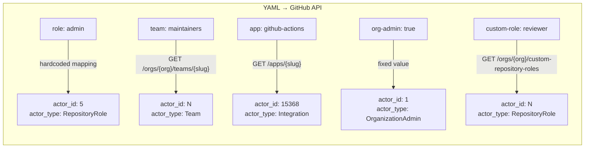

GitHub Rulesets identify bypass actors and status check providers by numeric IDs internally. gh-infra abstracts this away — you write human-readable names in YAML, and gh-infra resolves them to numeric IDs when calling the GitHub API.

## Bypass Actors

Each bypass actor in a ruleset is one of five types. You specify the type by field name:

```yaml
bypass_actors:
  - role: admin                # Built-in repository role
    bypass_mode: always
  - team: maintainers          # Organization team (by slug)
    bypass_mode: pull_request
  - app: github-actions        # GitHub App (by slug)
    bypass_mode: always
  - org-admin: true            # Organization administrators
  - custom-role: reviewer      # Enterprise Cloud custom role (by name)
    bypass_mode: pull_request
```

Exactly one type field must be specified per entry. `bypass_mode` is required for all except `org-admin`.

### How Each Type Resolves



#### `role` — Built-in Repository Role

Maps to a hardcoded, stable numeric ID. No API call needed.

| Name | API actor_id | Description |
|------|-------------|-------------|
| `admin` | 5 | Full repository admin access |
| `write` | 4 | Push access, manage issues/PRs |
| `maintain` | 2 | Manage repo settings without admin |

These IDs are not officially documented by GitHub but are stable across GitHub.com, GHES, and all major IaC providers.

#### `team` — Organization Team

Resolved via `GET /orgs/{org}/teams/{slug}` → `.id`.

- Requires `read:org` scope (included in default `gh auth` scopes)
- Only available for organization-owned repositories
- Works for nested (child) teams

#### `app` — GitHub App

Resolved via `GET /apps/{slug}` → `.id`. This is a public, unauthenticated endpoint.

The resolved value is the **App ID** (globally unique to the app), not the Installation ID. For example, `github-actions` resolves to App ID `15368`.

#### `org-admin` — Organization Administrators

No resolution needed. GitHub ignores the `actor_id` for this type — the API accepts any value. gh-infra sends `1` by convention.

:::note
GitHub.com returns `null` (0 in Go) for OrganizationAdmin actor_id, while GHES returns `1`. gh-infra handles this by comparing only the actor type during diff, ignoring the numeric ID entirely. This prevents false drift.
:::

#### `custom-role` — Enterprise Cloud Custom Role

Resolved via `GET /orgs/{org}/custom-repository-roles` → matched by name → `.id`.

Only available on GitHub Enterprise Cloud organizations with custom repository roles configured.

## Status Check App

The `app` field in `required_status_checks` identifies which GitHub App must provide the check:

```yaml
rules:
  required_status_checks:
    contexts:
      - context: "CI Gate"
        app: github-actions    # Only GitHub Actions can satisfy this check
      - context: "lint"        # Any provider accepted (app omitted)
```

### Resolution

**Forward (YAML → API):** Resolved via `GET /apps/{slug}` → `.id`, same as bypass actor apps. The resolved App ID is sent as `integration_id` in the API payload.

**Reverse (API → YAML on import):** Resolved via `GET /repos/{owner}/{repo}/commits/HEAD/check-runs`. Each check run includes the providing App's ID and slug, so gh-infra discovers the slug by matching the `integration_id` against check run results.

### Omission Behavior

| `app` field | API behavior |
|---|---|
| **Specified** (e.g., `app: github-actions`) | Only the named App can satisfy the check |
| **Omitted** | Any provider matching the context name satisfies the check |

For most users, omitting `app` is sufficient. Specify it only when you need to ensure a specific App provides the check — for example, to prevent a third-party app from satisfying a check by using the same name.

## Resolution Caching

Within a single `plan`, `apply`, or `import` execution, resolved IDs are cached. If multiple rulesets reference the same team or app slug, only one API call is made.

## Error Handling

If name resolution fails (e.g., team slug not found, app slug invalid), the `plan` or `apply` command stops with an error before making any changes. This ensures you never accidentally apply a ruleset with incorrect actor references.

## Reverse Resolution on Import

When `gh infra import` exports a repository's rulesets, numeric IDs from the API are converted back to human-readable names:

| API response | Exported YAML |
|---|---|
| `actor_id: 5, actor_type: RepositoryRole` | `role: admin` |
| `actor_id: N, actor_type: Team` | `team: {slug}` (resolved via org teams API) |
| `actor_id: N, actor_type: Integration` | `app: {slug}` (resolved via check-runs API) |
| `actor_type: OrganizationAdmin` | `org-admin: true` |
| `integration_id: N` in status checks | `app: {slug}` (resolved via check-runs API) |

If reverse resolution fails (e.g., no check-runs available for an unknown App ID), the export falls back to `app: id:N` format. This requires manual correction before the YAML can be used with `plan` or `apply`.
