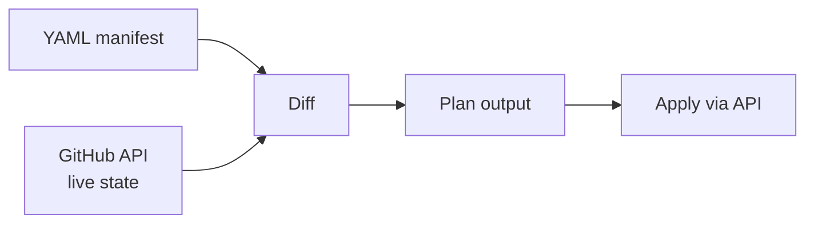

gh-infra does not use a state file. This is a deliberate design choice, not a missing feature. This page explains why, what trade-offs it creates, and how concurrent operations behave.

## Why No State File?

Traditional infrastructure-as-code tools like Terraform maintain a **state file** — a local or remote JSON snapshot of the last-known infrastructure state. Every `plan` compares desired config against this snapshot, and every `apply` updates it.

This creates operational overhead:

- **Storage**: The state must be stored somewhere durable (S3, GCS, Terraform Cloud)
- **Locking**: Concurrent operations must acquire a lock to prevent read-modify-write conflicts on the state file
- **Drift**: If someone changes infrastructure outside the tool, the state file becomes stale. You need `terraform refresh` or `terraform import` to resync
- **Secrets**: State files often contain sensitive values in plaintext

gh-infra avoids all of this by treating **GitHub itself as the source of truth**. Every `plan` fetches the live state directly from the GitHub API and diffs it against the YAML manifest. There is nothing to store, lock, or lose.

## How It Works



1. **Plan**: Fetch current state from GitHub API → diff against desired YAML → show changes
2. **Apply**: Same as plan, then execute the changes via API

The live state is fetched fresh on every invocation. There is no cached or persisted state between runs.

## Trade-offs

### What you gain

- **Zero infrastructure** — No remote backend, no bucket, no lock table
- **No drift by design** — Every plan reflects the actual GitHub state, not a stale snapshot
- **Idempotent** — Running `apply` twice with the same YAML produces no changes on the second run
- **No secrets in state** — Secret values exist only in environment variables, never persisted to disk

### What you give up

- **No lock mechanism** — There is no way to prevent two users from running `apply` simultaneously (see below)
- **Slower plans** — Every `plan` requires API calls to fetch current state. Terraform can diff against a local file instantly. gh-infra mitigates this with [parallel fetching](../concurrency/)
- **No resource tracking** — gh-infra only manages what is declared in YAML. It cannot detect "this repo was removed from the YAML but still exists on GitHub" because there is no previous state to compare against

## Concurrent Apply Behavior

Since there is no lock, two users (or CI jobs) can run `apply` simultaneously against the same repositories.

**What happens:**

- Both invocations fetch the current state independently
- Both compute their diffs and begin applying
- GitHub API calls are **last-write-wins** — if both change the same field, the last API call to complete determines the final value
- Neither invocation will fail (unless GitHub returns an error)

**Why this is acceptable:**

1. **CI serialization** — In practice, `apply` runs in CI on merge to `main`. Branch protection and merge queues ensure only one merge (and thus one apply) runs at a time
2. **Next plan detects drift** — Even if a concurrent apply creates an inconsistency, the next `plan` will show it as a diff because the live state is always fetched fresh
3. **No state corruption** — Unlike Terraform, there is no state file that can become corrupted or out of sync. The worst case is a temporarily unexpected value on GitHub, which the next apply corrects

**If you need strict serialization:**

- Use a CI mutex or concurrency group:
  ```yaml
  # GitHub Actions
  concurrency:
    group: gh-infra-apply
    cancel-in-progress: false
  ```
- Or use a merge queue so only one PR merges at a time

## Comparison with Terraform

| Aspect | Terraform | gh-infra |
|--------|-----------|----------|
| State storage | Required (S3, GCS, TFC, etc.) | None |
| Locking | Remote backend lock (DynamoDB, etc.) | None needed |
| Drift detection | `terraform refresh` (explicit) | Automatic on every `plan` |
| Concurrent apply | Blocked by lock (or corrupts state) | Last-write-wins, self-healing on next plan |
| Plan speed | Fast (local state diff) | Slower (API fetch), mitigated by parallelism |
| Deleted resources | Detected via state diff | Not detected (only manages declared resources) |
| Secret exposure | Plaintext in state file | Never persisted |
